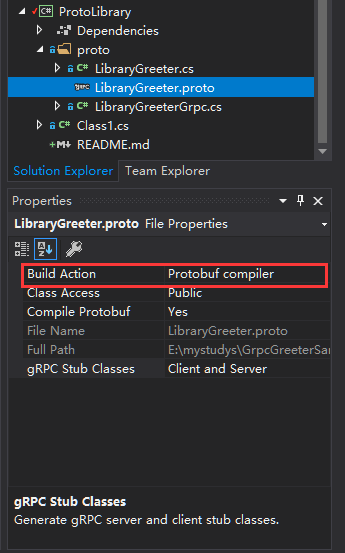

## 类库中编译.proto文件

### 1.引用NuGet packages
```powershell
Install-Package Grpc
Install-Package Grpc.Tools
Install-Package Google.Protobuf
```

### 2.编辑.csproj文件
- 生成.cs资产文件在.proto文件夹
```c#
  <ItemGroup>
    <Protobuf Include="**/*.proto" OutputDir="%(RelativeDir)" CompileOutputs="false" />
  </ItemGroup>
```
- 生成.cs资产文件在obj文件夹,最后编译到dll库文件
```c#
  <ItemGroup>
    <Protobuf Include="**/*.proto" />
  </ItemGroup>
```

### 3.添加.proto文件
- 代码
```protobuf
syntax = "proto3";

option csharp_namespace = "ProtoLibrary.GrpcService";

package ProtoLibrary.Grpc;

//说Hello请求
message SayHelloRequest {
	//消息
	required string Message = 1;
}

//说Hello响应
message SayHelloResponse {
	//消息
	string Message = 1;
	//响应时间
	string Time = 2;	
	//性别
	enum Sex {
		Default = 0;
		Male = 1;
		Female = 2;
	}
}

//Hello服务
service HelloService {
	//发送Hello
	rpc SayHello (SayHelloRequest) returns (SayHelloResponse);
}
```

- 设置文件属性
>设置Build Action 为 Protobuf compiler
<p align="left">


</p>